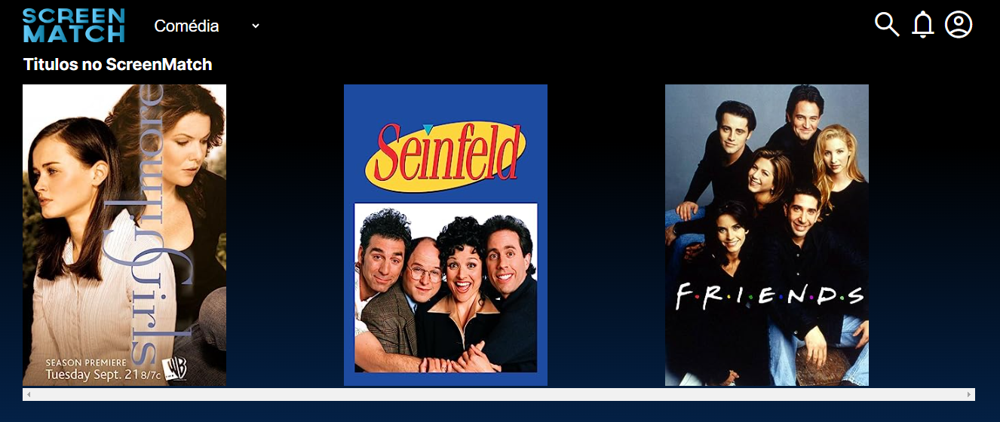
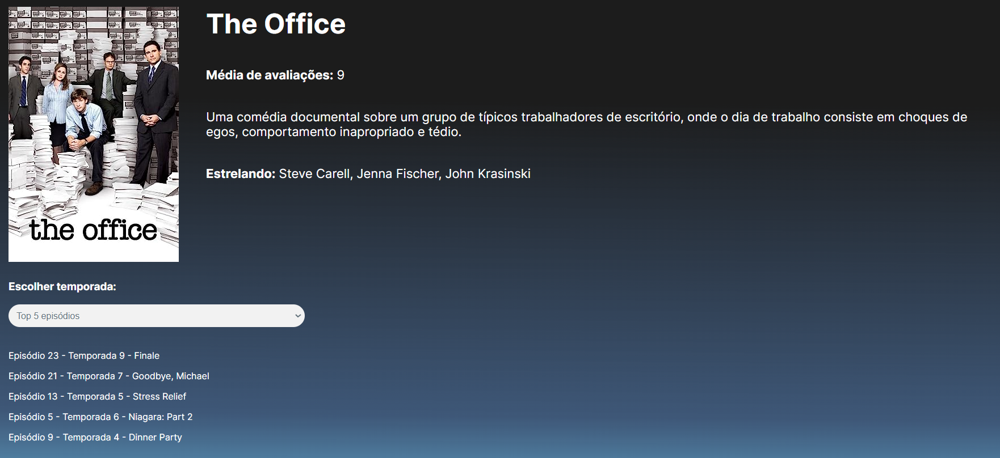

# ScreanMatch

ScreanMatch é uma aplicação web que utiliza uma API em Java Spring Boot para exibir dados de filmes e séries. A aplicação tem um frontend dinâmico construído com JavaScript, que se comunica com a API para buscar e exibir informações detalhadas sobre séries, temporadas e episódios.

## Funcionalidades

- Exibição de informações detalhadas sobre séries, incluindo título, avaliação, sinopse e elenco.
- Listagem de todas as temporadas disponíveis de uma série.
- Visualização dos episódios de uma temporada específica ou de todas as temporadas.

## Estrutura do Projeto

- **Backend**: API RESTful desenvolvida em Java com Spring Boot.
- **Frontend**: Interface web interativa usando HTML, CSS e JavaScript.

## Pré-requisitos

- Java 17 ou superior
- Maven 3.6.0 ou superior
- Banco de dados postgres ou mysql 

---

Se você tiver alguma dúvida ou sugestão, sinta-se à vontade para abrir uma issue ou contribuir com o projeto. Agradecemos seu interesse em melhorar o ScreanMatch!